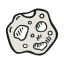

A small demo for gnAsteroid. Here are some internal links:

* [gnAsteroid manual](README.md)
* a [subdir/](subdir/)
* [svg collection](svg)
* [define a title for a page](titles.md)
* [markdown cheatsheet](syntax.md)

# How to render smart-contracts directly on an asteroid

What? You read well! What does that even mean?

* [gno.land](https://gno.land) is a smart-contract platform using code written in GNO, a dialect of golang.
* Those smart-contracts (realms) can render code in markdown, which asteroids can directly access.

An example? Instead of a link to a regular file, link to a path beginning by `/r/`, and it will access and render that realm on gno.land if it exists, on this asteroid. 

For instance `> Show a [random gnoface](/r/demo/art/gnoface) ([sourcecode](/r/demo/art/gnoface/gnoface_test.gno))` is rendered like this:

> Show a [random gnoface](/r/demo/art/gnoface) ([sourcecode](/r/demo/art/gnoface/gnoface_test.gno))

You can personally check both the smart-contract, and the source-code work by clicking both links.

## Origin of the name Asteroid

If the chain is on gno.land, those small websites that show executed smart-contracts can be thought as asteroids, orbiting a planet... Each asteroid can have its own decoration (*theme*).
